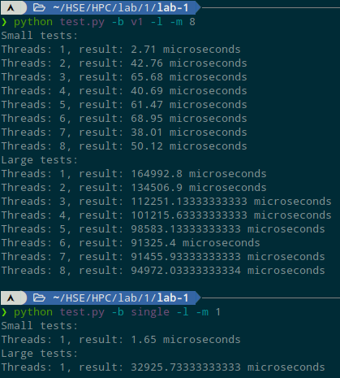
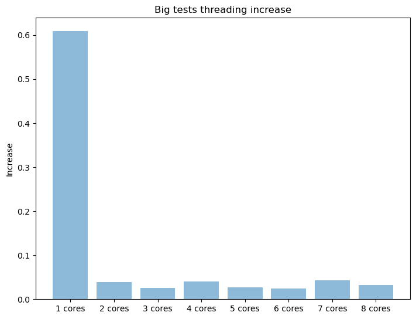
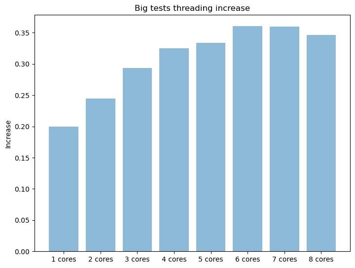

# Какие файлы есть
* `dp.cpp` -- решение с помощью динамического программирования, для проверки ответа
* `single.cpp` -- однопоточный перебор по инструкции из чата
* `v1.cpp` -- первый вариант многопоточного решения, более удачный (проигрывает всего в 2-3 раза однопоточному (на 100 элементах)
* `v2.cpp` -- второй вариант многопоточного решения, менее удачный (не смог дождаться на 100 элементах, поэтому рассматриваться не будет)
* `dp.cpp` -- решение динамическим программированием, для проверки корректности ответа
* `Makefile` -- чтобы все это скомпилить. `make` -- все собрать, `make tsan` -- собрать v1 и v2 с thread sanitizer,  `make clean` - удалить бинарники.
* `gen_tests.py` -- генератор тестов, реально не используется.
* `draw_graphs.py` -- рисовалка графиков по захардкоженным значениям. Использовал в конце для создания крафиков и все.

# Как запускалось
На абсоютно разгруженной системе.

Процессор `Intel(R) Core(TM) i5-8250U CPU @ 1.60GHz`.

Hardware concurrency 8.

# Результаты
Не смог даже приблизиться к однопоточному решению (`single`)

Результат запуска:

Ускорение (точнее проигрыш, потому что меньше 1) на маленьких тестах(`v1`):

Проигрыш на больших тестах:

Итог всего в 4 раза медленнее!!!
Скорее всего на кластерах или Xeon или i9 процессорах будет даже выигрыш.